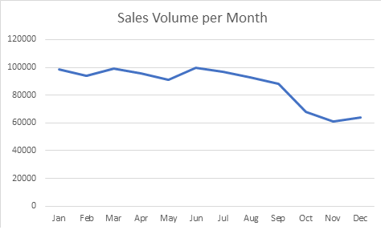
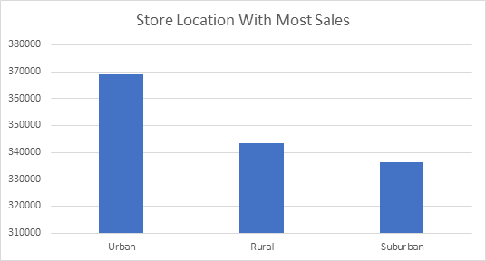
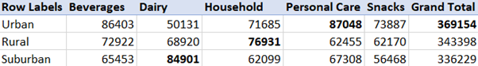
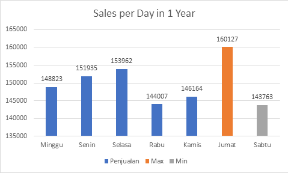
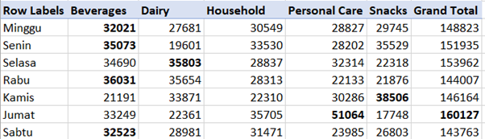
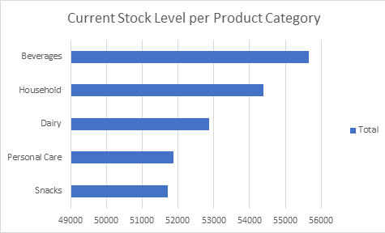
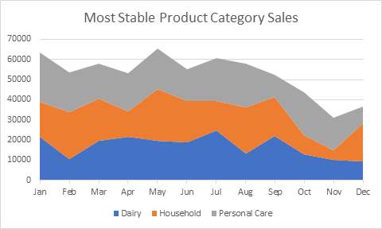
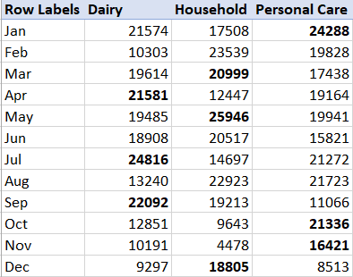

# Laporan Analisis Data Perusahaan Fast Moving Consumer Goods (FMCG) pada PT Bintang Konsumsi Global

## Deskripsi Perusahaan

PT Bintang Konsumsi Global adalah perusahaan yang bergerak di bidang Fast-Moving Consumer Goods (FMCG), menghadirkan produk berkualitas tinggi untuk memenuhi kebutuhan sehari-hari masyarakat Indonesia. Dengan fokus pada inovasi, efisiensi, dan keberlanjutan, kami berkomitmen untuk menyediakan produk makanan, minuman, serta kebutuhan rumah tangga yang aman, sehat, dan terjangkau bagi konsumen

## Produk dan Layanan:

PT Bintang Konsumsi Global menawarkan berbagai kategori produk FMCG, termasuk:

- Makanan & Minuman – Produk olahan berkualitas tinggi yang praktis dan sehat.
- Kebutuhan Rumah Tangga – Produk kebersihan dan perawatan rumah yang inovatif.
- Produk Perawatan Diri – Produk perawatan pribadi yang diformulasikan dengan bahan terbaik.

Dengan tim profesional dan komitmen terhadap kualitas, PT Bintang Konsumsi Global terus berkembang untuk memberikan nilai terbaik bagi konsumen dan mitra bisnis di seluruh Indonesia

## Pertanyaan bisnis perusahaan:

1. Pada bulan apa penjualan paling laris dan pada produk apa?
2. Di mana kah store location dengan sales volume paling tinggi dan pada produk apa?
3. Pada hari apa toko dengan jumlah sales volume terbanyak?
4. Tunjukkan Stok level saat ini per product category

## Metrik data yang dianalisis:

- **Date** = Menunjukkan time series volume penjualan perbulan
- **Product Category** = Menunjukkan Kategori produk yang akan dioptimalkan untuk promosi dan juga memaksimalkan keuntungan
- **Sales Volume** = Menunjukkan angka penjualan pada setiap produk untuk memberikan insight
- **Weekdays** = Hari dalam satu minggu
- **Store Location** = Lokasi toko
- **Stock Level** = Keterangan stok yang ada untuk setiap kategori produk

# Hasil Analisis Data:

## Pada bulan apa penjualan paling laris dan pada produk apa?

Insight:
 Penjualan tertinggi ada pada bulan Juni dengan volume penjualan sebesar 99.558 unit terjual dengan peningkatan sebesar 9.11% dari bulan sebelumnya, produk yang paling banyak terjual adalah beverages atau minuman dengan banyak unit terjual adalah 28.111.

### Di mana kah store location dengan sales volume paling tinggi dan pada produk apa?

Insight:
 Penjualan tertinggi ada pada Toko daerah Urban dengan penjualan sebesar 369.154 dengan produk paling banyak terjual adalah Personal Care sebanyak 87.048

### Pada hari apa toko dengan jumlah sales volume terbanyak?

Insight:
 Penjualan tertinggi ada pada hari Jumat dengan peningkatan penjualan sebesar 9,55% dari hari sebelumnya, product paling laku terjual adalah Personal Care yang terjual sebanyak 51.064 unit laku lebih besar 68,62% dari hari sebelumnya.
Domain Knowledge dan Rekomendasi Bisnis:

- Senin, hari pertama orang kerja, biasanya hari pertama orang kerja dengan pembawaan masih suasana liburan maka dari itu beberapa diantara mereka butuh kopi untuk menambah energi, berdasarkan hasil analisis data beverages atau minuman menjadi produk kategori dengan sales paling banyak.

Jadi rekomendasi bisnis disini adalah menambah varian kopi atau menambah stok kopi agar orang-orang semakin tertarik untuk membeli kopi dan juga menambah sales volume beverages sebesar 10%

- Kamis, hari keempat orang kerja, orang-orang sudah mulai terbiasa dengan rutinitas di hari kerja, mereka sehingga mereka cenderung membeli snacks bisa jadi untuk mereka sendiri maupun untuk dibagi dengan rekan kerjanya.

Jadi rekomendasi bisnis disini adalah menambah stok snacks agar tidak mengalami kekurangan lalu melakukan strategi pembelian secara bundle dengan produk lain yang sales volumenya paling sedikit yaitu beverages atau minuman sehingga bisa mengefektifkan revenue dengan meningkatkan pejualan beverages yang rendah pada hari kamis serta meningkatkan penjualan snacks.

### Tunjukkan Stok level saat ini per product category

Insight:
 Terdapat penipisan pada stock level snacks, personal care, dan dairy sehingga dapat dilakukan restock untuk barang baru serta penghabisan untuk barang lama jika sudah mendekati masa kedaluwarsa, berlaku juga untuk product beverage yang memiliki stok cenderung aman tetapi jika ada barang yang mendekati masa kedaluwarsa sebaiknya stoknya segera dihabiskan untuk mencegah overstock dan efisiensi penyimpanan.

## Analisis Lanjutan

### Produk dengan penjualan paling stabil

Insight:
 Produk Dairy (Susu), Household (Peralatan Rumah) dan Personal Care (Perawatan) walaupun bukan produk dengan penjualan tertinggi di tahun ini dibandingkan beverages tetapi memiliki penjualan yang stabil yaitu dalam waktu satu tahun dengan mendapati 3 kali penjualan tertinggi dalam setiap bulannya,

Rekomendasi bisnis:
 Membangun loyalitas pelanggan khusus untuk pembeli product Dairy, Household, dan Personal care atau mempertimbangkan produk secara B2B untuk meningkatkan sales dalam jumlah yang lebih besar
